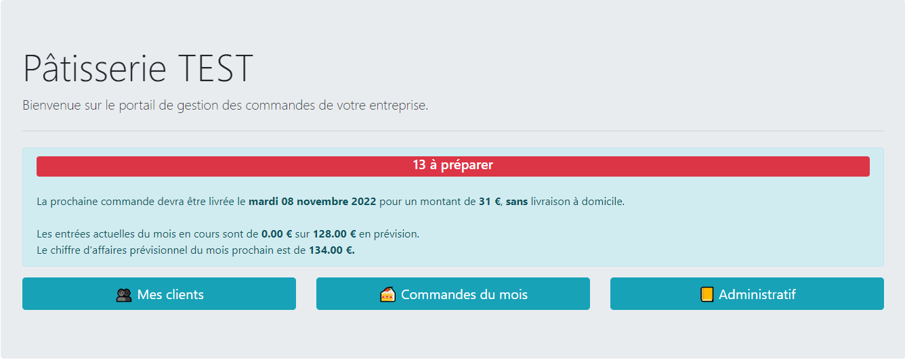
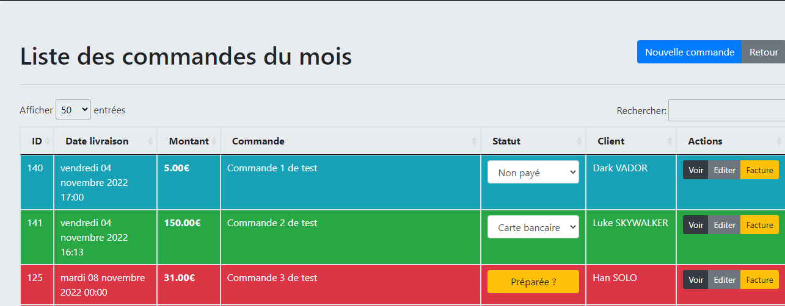
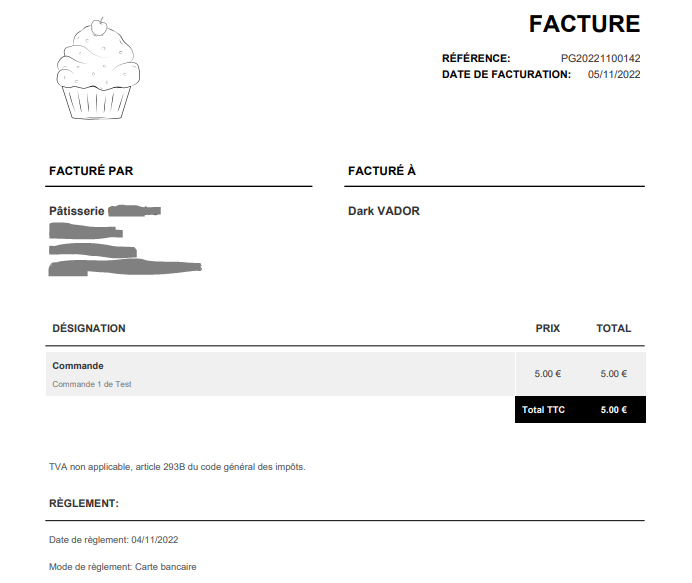

# gestion-patisserie
Une application métier permettant la gestion des commandes et des clients d'une pâtisserie.  
La personnalisation se fait en modifiant le fichier [config/services.yaml](config/services.yaml).
## Installation
Ce projet utilise le framework Symfony. Il requiert un serveur MySQL.  
Un fichier `.env` contenant les informations d'authentification à la base de données doit être présent à la racine.
## Utilisation
### Page d'accueil

### Gestion des commandes
Chaque commande est obligatoirement liée à un client. Une page dédiée permet la gestion des commandes:
  
#### Générer une facture
Il est possible de générer une facture au format PDF à la volée pour chaque commande:

